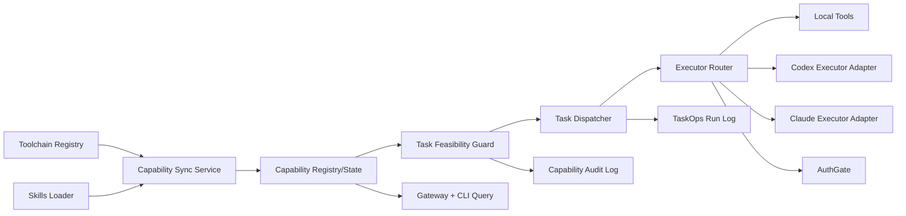

# S1 核心能力治理（2+3）需求架构与实施计划 v1

- 日期: 2026-02-22
- 阶段: S1（在 T10 联调收口后启动）
- 范围: chimera-core 的“基础能力服务（skills/toolchain/executor）+ 能力注册治理（capability registry）”
- 目标: 让 nanobot 对“自己能做什么、当前能否做、应由谁做”形成可计算、可观测、可审计的闭环

---

## 1. 结论先行

1. 当前 chimera-core 已具备 TaskOps 控制面与审计基础，但“能力层”尚未闭环。
2. S1 的核心不是再加新任务模块，而是把 **Toolchain + Skills + TaskOps + AuthGate + Executor** 统一到一个能力治理平面。
3. `codex` 与 `claude code` 应纳入“可调用基础能力”，但以 **适配器配置化** 方式接入，不把具体 CLI 参数硬编码到核心逻辑。
4. 本地 LLM 优化不作为 S1 主目标；S1 完成后再并行灰度更稳。

---

## 2. 现状基线（已落地能力）

### 2.1 已有能力治理雏形

- Toolchain 注册表与健康检查：
  - `/Users/sourcefire/X-lab/chimera-core/nanobot/chimera_bridge/toolchain.py`
  - `/Users/sourcefire/X-lab/chimera-core/chimera-bridge/toolchain/registry.json`
- Skills 加载器（workspace + builtin）:
  - `/Users/sourcefire/X-lab/chimera-core/nanobot/agent/skills.py`
  - `/Users/sourcefire/X-lab/chimera-core/nanobot/skills/README.md`
- TaskOps 控制面 + 运行日志 + 事件：
  - `/Users/sourcefire/X-lab/chimera-core/nanobot/taskops/controlplane.py`
  - `/Users/sourcefire/X-lab/chimera-core/nanobot/taskops/runlog.py`
- 权限闸门（含 profile/mission）：
  - `/Users/sourcefire/X-lab/chimera-core/nanobot/auth/gate.py`

### 2.2 现存断点（S1 要解决）

1. Toolchain 与 Skills 未统一建模，TaskOps 不能计算“任务是否可执行”。
2. 能力状态缺少“可执行/不可执行”判定结果（只看到 enabled/health，缺少 readiness 语义）。
3. 执行器（local tools / codex / claude）缺少统一路由策略。
4. 任务需求侧（required capabilities）缺字段与校验，自动分发无法进行前置筛选。

---

## 3. 设计目标与原则

## 3.1 目标

- G1: 统一能力模型（Capability Registry）
- G2: 统一能力状态（Health/Auth/Readiness）
- G3: 任务可执行性计算（Task Feasibility）
- G4: 统一执行器路由（Executor Router）
- G5: 全链路可观测与可审计

## 3.2 设计原则

- P1: Task-first（任务优先）——能力服务于任务，不反向绑架流程。
- P2: Config-driven（配置驱动）——执行器参数、健康检查、风险等级均配置化。
- P3: Safe-by-default（默认安全）——不满足能力前置条件即阻断，不做隐式降级。
- P4: Progressive（渐进演进）——先单机 JSON + CLI，后续再考虑 DB/UI。

---

## 4. S1 功能需求（FR）

### FR-01 统一能力注册表

新增目录：`chimera-bridge/capabilities/`

- `registry.json`: 能力定义（静态）
- `registry.schema.json`: 能力定义 schema
- `state.json`: 能力运行状态（动态）
- `state.schema.json`: 状态 schema

能力类型建议：

- `tool`（本地工具，如 web_search/web_fetch）
- `skill`（技能包）
- `executor`（执行器，如 codex/claude）
- `channel`（协同通道，如 telegram）
- `service`（外部服务，如 github/feishu/1password）

### FR-02 Toolchain/Skills 自动汇聚

提供同步命令（示例）：

- `nanobot capability sync --from toolchain --from skills`

同步逻辑：

- Toolchain 作为 service/tool 能力来源
- Skills 作为 skill 能力来源
- 冲突按优先级覆盖（workspace > builtin > toolchain defaults）

### FR-03 能力可用性判定（Readiness）

readiness 状态建议：`ready | degraded | blocked | unknown`

计算维度：

- binary 可用性
- env/secret 可用性
- auth token 是否就绪
- policy 是否允许（AuthGate）
- 依赖能力是否满足

### FR-04 任务能力需求建模

扩展 `taskops/tasks.schema.json` 与 `tasks.json` 字段：

- `requiredCapabilities: string[]`
- `preferredExecutor: string`（如 `executor:codex`）
- `fallbackExecutors: string[]`
- `capabilityStatus: ready|blocked|degraded|unknown`
- `capabilityReason: string`

### FR-05 任务可执行性前置校验

在 claim 前加入 `TaskFeasibilityGuard`：

- 若 `requiredCapabilities` 未满足，任务标记 `blocked` 并写 `capabilityReason`
- 若满足，进入正常 claim/dispatch

### FR-06 执行器路由（含 codex/claude）

新增 `ExecutorRouter`：

- 路由目标：`local-tools | executor:codex | executor:claude`
- 由 `preferredExecutor + readiness + policy` 决策
- 执行器调用命令模板由配置提供（不硬编码具体参数）

### FR-07 能力治理 API 与 CLI

新增 gateway methods（最小集）：

- `capability.list`
- `capability.status`
- `capability.check`
- `capability.sync`
- `taskops.feasibility`

新增 CLI（最小集）：

- `nanobot capability list`
- `nanobot capability check [--id <cap>]`
- `nanobot capability sync`
- `nanobot taskops feasibility [--task-id <id>]`

### FR-08 审计与运行日志

新增日志流：

- `chimera-bridge/capabilities/runs/*.jsonl`
- 记录字段：`action`, `capabilityId`, `status`, `reason`, `executor`, `taskId`, `durationMs`

---

## 5. 非功能需求（NFR）

- NFR-01: 任何能力检查失败不应导致 gateway 崩溃（降级为 `blocked/degraded`）。
- NFR-02: 能力检查单次超时可配置，默认 8s。
- NFR-03: 所有写入采用原子写/锁（延续 TaskHub 模式）。
- NFR-04: 关键决策（blocked/route/deny）必须进入审计日志。

---

## 6. 技术架构（v1）



---

## 7. 数据模型建议（关键字段）

## 7.1 capability registry entry（示例）

```json
{
  "id": "executor:codex",
  "type": "executor",
  "name": "Codex CLI Executor",
  "enabled": true,
  "riskLevel": "high",
  "requires": {
    "bins": ["codex"],
    "env": ["OPENAI_API_KEY"]
  },
  "healthCheck": "codex --help",
  "adapter": {
    "kind": "cli",
    "commandTemplate": ["codex", "exec", "--json", "${prompt}"]
  }
}
```

> 注：`commandTemplate` 为配置项示例，最终参数由适配器配置决定，可按实际 CLI 能力调整。

## 7.2 task capability status（示例）

```json
{
  "id": "task-123",
  "requiredCapabilities": ["service:github", "executor:codex"],
  "preferredExecutor": "executor:codex",
  "fallbackExecutors": ["local-tools"],
  "capabilityStatus": "blocked",
  "capabilityReason": "missing OPENAI_API_KEY"
}
```

---

## 8. 实施计划（M1-M4）

## M1（2-3天）能力注册统一

- 新增 `capabilities/registry|state` schema 与默认文件
- 实现 toolchain + skills 汇聚器
- 增加 `nanobot capability sync/list`

交付件：

- `nanobot/capability/registry.py`
- `nanobot/capability/sync.py`
- `chimera-bridge/capabilities/*.json`

## M2（2-3天）readiness 与检查引擎

- 实现 `capability.check`（单项/全量）
- 写入 `state.json` 与审计日志
- 打通 gateway method + CLI

交付件：

- `nanobot/capability/checker.py`
- `nanobot/capability/controlplane.py`

## M3（3-4天）TaskOps 可执行性 + 路由

- 扩展 tasks schema 字段
- claim 前置 feasibility guard
- 接入 `ExecutorRouter` + codex/claude 适配器（配置化）

交付件：

- `nanobot/taskops/feasibility.py`
- `nanobot/taskops/router.py`
- `nanobot/executors/codex_adapter.py`
- `nanobot/executors/claude_adapter.py`

## M4（2天）收口与治理

- 增加能力日志查询命令
- 增加回归测试矩阵
- 更新 Issue-Checks 文档与合并门禁

---

## 9. 验收标准（Checks）

### C01-C04（M1）

- C01: `capability sync` 可从 toolchain + skills 生成统一 registry
- C02: registry schema 校验通过
- C03: 冲突覆盖规则符合预期
- C04: `capability list` 输出完整（type/risk/requires）

### C05-C08（M2）

- C05: `capability check` 能生成 readiness 状态
- C06: 缺少 env/binary 时标记 `blocked` 并给 reason
- C07: 检查结果写入 state.json
- C08: 审计日志包含 capability decision 事件

### C09-C12（M3）

- C09: 任务 requiredCapabilities 未满足时不会被 claim
- C10: 满足条件任务可正常 claim/dispatch
- C11: `preferredExecutor=executor:codex` 可路由到 codex 适配器
- C12: codex 不可用时 fallback 到配置的替代执行器（若配置）

### C13-C16（M4）

- C13: gateway methods `capability.*` 可用
- C14: 回归通过（taskops/auth/deploy 基线）
- C15: 文档、索引、任务卡、验收单一致
- C16: 关键路径联调通过（真实通道 + 人工协同）

---

## 10. 风险与缓解

- R1: 能力状态抖动导致任务频繁 blocked/unblocked
  - 缓解: 增加最小稳定窗口 + 最近一次成功缓存
- R2: 执行器适配参数不稳定
  - 缓解: 适配器模板配置化 + 每个执行器独立 smoke tests
- R3: 权限策略与路由冲突
  - 缓解: 在路由决策中先走 AuthGate pre-check，再执行

---

## 11. 分支与协作建议

- 建议分支: `codex/feature-capability-governance-v1`
- 子任务拆分（可并行）：
  1. registry/schema（数据面）
  2. checker/controlplane（状态面）
  3. task feasibility + router（执行面）
  4. tests + docs（质量面）

---

## 12. OpenClaw 参考实现（借鉴点）

### 12.1 skills 汇聚与优先级

- `/Users/sourcefire/1data/xx-lab/openclaw/src/agents/skills/workspace.ts`
  - 借鉴点: 多来源技能合并与覆盖优先级

### 12.2 skills 可用性过滤

- `/Users/sourcefire/1data/xx-lab/openclaw/src/agents/skills/config.ts`
  - 借鉴点: requires（bins/env/config）驱动的可用性筛选

### 12.3 执行审批与技能能力联动

- `/Users/sourcefire/1data/xx-lab/openclaw/src/node-host/runner.ts`
- `/Users/sourcefire/1data/xx-lab/openclaw/src/node-host/invoke.ts`
  - 借鉴点: exec approvals + autoAllowSkills + skillBins

### 12.4 控制面 API 设计与参数校验

- `/Users/sourcefire/1data/xx-lab/openclaw/src/gateway/server-methods/cron.ts`
  - 借鉴点: method 化 + validate + error shape

### 12.5 运行日志

- `/Users/sourcefire/1data/xx-lab/openclaw/src/cron/run-log.ts`
  - 借鉴点: append/read/prune 统一封装

---

## 13. 里程碑完成定义（DoD）

- DoD-1: 能力注册与状态可查询、可检查、可审计
- DoD-2: TaskOps 可依据能力状态自动阻断或放行
- DoD-3: codex/claude 执行器被纳入统一路由与治理
- DoD-4: 文档、测试、回归、联调记录完整

---

## 14. 一句话执行建议

先完成你当前 master 的联调收口；随后直接启动 S1，把“能力注册 + 可执行性 + 执行器路由”一次打通，优先保证稳定可运营，再考虑本地 LLM 深化。 
